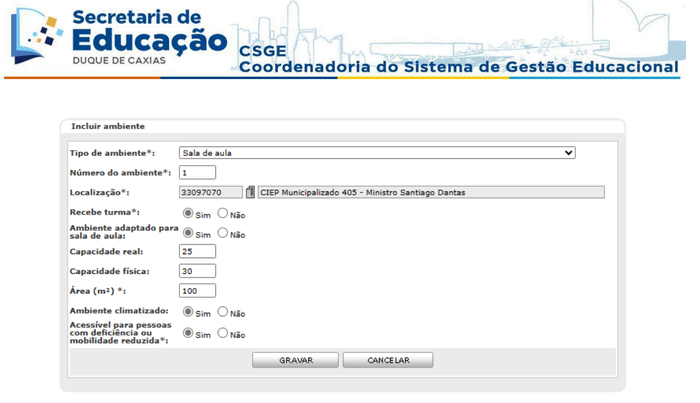

# Manual eDuque - Abertura do Ano Letivo

## Sumário

1. REVISÃO CADASTRO DA UNIDADE
2. AMBIENTE
3. ABERTURA DE PERÍODO LETIVO
4. TURMA REGULAR
5. MATRICULAR ALUNO
6. ENTURMAÇÃO DO ALUNO
7. ORGANIZAÇÃO DA TURMA
8. ATRIBUIÇÃO DE AULAS
9. QUADRO DE HORÁRIOS
10. CONSULTAS DO PROCESSO

## 1. REVISÃO CADASTRO DA UNIDADE

O cadastro ocorrerá no módulo Rede de Ensino através do menu Cadastros > Infraestrutura > Unidade Interna. Ao chegar nessa tela clique em pesquisar, selecione a escola e clique neste ícone para alterar o cadastro. Lembrando que o cadastro da unidade já foi feito, essa atividade será apenas para revisar e complementar, caso haja necessidade, os cadastros já realizados. A aba equipe nesse momento será preenchida apenas com o Diretor Geral, Vice-Diretor, Supervisor, Secretário, Educador de Apoio (Dirigente de Turno).

## 2. AMBIENTE

O cadastro ocorrerá no módulo Rede de ensino, através do menu Cadastros > Infraestrutura > Ambiente para cadastrar os ambientes existentes nas unidades (escolas e outros órgãos) da rede de ensino. Nessa tela também é possível pesquisar os ambientes já cadastrados para a unidade (o que é bastante útil pois pode evitar que seja criado um ambiente duplicado de algum já existente).

Para criar um ambiente clique no ícone de inclusão, insira as informações do ambiente: Tipo (sala de aula, almoxarifado, banheiro etc.); Número (a numeração será dada da forma que a unidade achar mais adequada, só não poderá repetir o mesmo número para o mesmo tipo de ambiente); Localização (estará preenchido com o nome da sua unidade); Recebe turma (se esse campo for preenchido com “Não”, o ambiente não será exibido durante a criação das turmas); Ambiente adaptado para sala de aula; Capacidade real; Capacidade física; Área (m²); Ambiente climatizado, Acessível para pessoas com deficiência ou mobilidade reduzida.

**_Caso não saiba a medida de algum ambiente, a equipe deverá contactar o setor responsável pela medição das escolas para que ele possa passar a informação ou realizar a medição do ambiente._**

Após a inserção de todas as informações, clique no botão ‘GRAVAR’ e o ambiente será criado. O botão CANCELAR voltará a tela de pesquisa e descartará todos os dados preenchidos. Lembre-se: se não for marcado que o ambiente recebe turma, o mesmo não será exibido para utilizar no cadastro da turma.

Após a criação do ambiente, o sistema voltará a tela de pesquisa onde será possível criar um novo ambiente, alterar, detalhar os ambientes já cadastrados. Sendo que, para todas essas atividades, será necessário selecionar o ambiente (pesquisando todos os ambientes criados e marcando o círculo à esquerda do ambiente desejado).

**_Sugestão: É importante que todos os ambientes da escola estejam criados e associados às suas respectivas turmas pois trata-se de uma importante informação para o Educacenso._**

## 3. ABERTURA DE PERÍODO LETIVO

Para realizar a ação, entre no módulo Aluno e no menu Período letivo > Abertura. Será nesse local que abriremos o ano letivo de um curso anual ou semestral e as turmas diversificadas. Preencha os campos: tipo de turma (Regular ou Diversificada), curso (Curso encerrado), selecione o curso (este campo só irá aparecer os cursos que já foram encerrados), preencha a data de início do período letivo (01/02/2024). Após a inserção clique no botão ‘PROCESSAR’ e o sistema executará a abertura.

## 4. TURMA REGULAR

Acesse o Módulo Rede de Ensino > Cadastro > Acadêmico > Turma regular > Ano: 2024 > Pesquisar. Para as turmas que não funcionarão em 2024, selecionar e clicar no ícone (extinguir/ativar). As turmas que funcionarão em 2024, selecionar, clicar no ícone alterar (lápis) e conferir todo o cadastro.

## 5. MATRICULAR ALUNO

A matrícula será realizada no módulo Aluno no menu Alunos > Matrícula > Matrícula de aluno. Nela será possível efetuar a matrícula dos alunos da rede de ensino. Por esse menu é possível verificar a matrícula de novos alunos, alunos nas situações: 'Concluinte', 'Desistente', e 'Transferido'.

## 6. ENTURMAÇÃO DO ALUNO

A enturmação será realizada no módulo aluno no menu Turmas > Enturmação. Nela será possível a atribuição de alunos para cada tipo de turma (regular ou diversificada). Turma regular permite a enturmação de alunos que estão matriculados na unidade escolar. Turma diversificada (Turmas de AEE e PROSA) permite a enturmação em turmas diversificadas de alunos da rede de ensino.

## 7. ORGANIZAÇÃO DA TURMA

A organização da turma será realizada no módulo Aluno no menu Turmas > Organização. Nessa tela será possível organizar as turmas individualmente. Para isso, insira os dados Tipo de turmas, Curso, Série, Ano e clique no botão ‘PESQUISAR’.

## 8. ATRIBUIÇÃO DE AULAS

O cadastro das aulas de cada servidor será realizado no módulo Servidor e a primeira ação será realizar o levantamento de demanda de professores para a escola. Isso será realizado em Atribuição de aulas > Saldo de Classes > Gerar saldo de classes a atribuir.

## 9. QUADRO DE HORÁRIOS

A montagem do quadro de horários será no módulo servidor seguindo o caminho: Atribuição de aulas >
