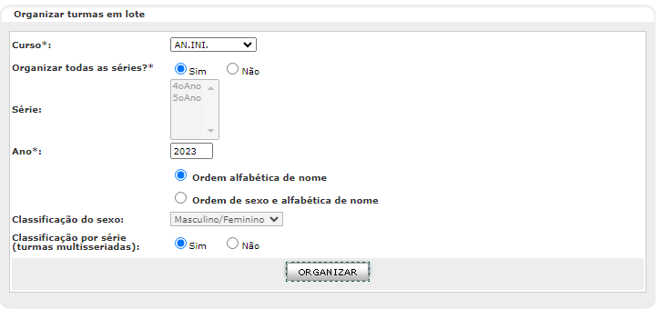

**Manual de Uso do e-Duque - Abertura do Ano Letivo**

**Sumário**

[1. REVISÃO CADASTRO DA UNIDADE](#1-revisão-cadastro-da-unidade)

[2. AMBIENTE](#2--ambiente)

[3. ABERTURA DE PERÍODO LETIVO](#3-abertura-de-período-letivo)

[4. TURMA REGULAR](#4-turma-regular)

[5. MATRICULAR ALUNO](#5-matricular-aluno)

[6. ENTURMAÇÃO DO ALUNO](#6-enturmação-do-aluno)

[7. ORGANIZAÇÃO DA TURMA](#_heading=h.1t3h5sf)

[8](#8-atribuição-de-aulas)[. ATRIBUIÇÃO DE AULAS](#8-atribuição-de-aulas)

[9](#9-quadro-de-horários)[. QUADRO DE HORÁRIOS](#9-quadro-de-horários)

[10. CONSULTAS DO PROCESSO](#10-consultas-do-processo)

**INTRODUÇÃO**

Bem-vindo ao "Manual de Uso do e-Duque". Este guia foi cuidadosamente elaborado para proporcionar a você uma visão abrangente e detalhada do nosso sistema educacional integrado e, assim, capacitar você a utilizar as suas funcionalidades com confiança e eficácia.

Nossa motivação para criar este manual é impulsionada por um profundo compromisso com a educação de qualidade e com a constante busca por melhorias no processo educacional. Acreditamos que a tecnologia desempenha um papel fundamental na transformação da maneira como aprendemos e ensinamos, e é por isso que desenvolvemos esta ferramenta poderosa, que visa revolucionar a educação de nossa cidade.

Este documento não é apenas um guia passo a passo; é um convite para explorar novas maneiras de planejar o futuro da educação de Duque de Caxias. Encorajamos você a explorar as funcionalidades do sistema e buscando maneiras de aprimorar sua prática educacional ou a gestão escolar.

À medida que avançamos na jornada da educação, contamos com você, para fazer deste sistema uma ferramenta que promova a excelência educacional e crie oportunidades de aprendizado infinitas. A educação é a chave para um futuro brilhante, e estamos empolgados em fazer parte desta jornada com você.

Com respeito e carinho

Coordenadoria do Sistema de Gestão Educacional

# **1. REVISÃO CADASTRO DA UNIDADE**

O cadastro ocorrerá no módulo **Rede de Ensino**, através do menu Cadastros \> Infraestrutura \> Unidade Interna. Ao chegar nessa tela clique em pesquisar, selecione a escola e clique neste ícone  para alterar o cadastro. Lembrando que o cadastro da unidade já foi feito, essa atividade será apenas para revisar e complementar, caso haja necessidade, os cadastros já realizados. A aba equipe nesse momento será preenchida apenas com o Diretor Geral, Vice-Diretor, Supervisor, Secretário, Educador de Apoio (Dirigente de Turno).

# **2 . AMBIENTE**

O cadastro ocorrerá no módulo **Rede de ensino**, através do menu Cadastros \> Infraestrutura \> Ambiente para cadastrar os ambientes existentes nas unidades (escolas e outros órgãos) da rede de ensino. Nessa tela também é possível pesquisar os ambientes já cadastrados para a unidade (o que é bastante útil pois pode evitar que seja criado um ambiente duplicado de algum já existente).  
Para criar um ambiente clique no ícone de inclusão , insira as informações do ambiente: **Tipo** (sala de aula, almoxarifado, banheiro etc.); **Número** (a numeração será dada da forma que a unidade achar mais adequada só não poderá repetir o mesmo número para o mesmo tipo de ambiente); **Localização** (estará preenchido com o nome da sua unidade); **Recebe turma** (se esse campo for preenchido com “Não”, o ambiente não será exibido durante a criação das turmas); **Ambiente adaptado para sala de aula**; **Capacidade real**; **Capacidade física**; **Área** **(m²)**; **Ambiente climatizado**, **Acessível para pessoas com deficiência ou mobilidade reduzida**.

*Caso não saiba a medida de algum ambiente a equipe deverá contactar o setor responsável pela medição das escolas para que ele possa passar a informação ou realizar a medição do ambiente.*

Após a inserção de todas as informações, clique no botão ‘GRAVAR’ e o ambiente será criado. O botão CANCELAR voltará a tela de pesquisa e descartará todos os dados preenchidos. Lembre-se: se não for marcado que o ambiente recebe turma, o mesmo não será exibido para utilizar no cadastro da turma.

Após a criação do ambiente, o sistema voltará a tela de pesquisa onde será possível criar um novo ambiente, alterar , detalhar  os ambientes já cadastrados. Sendo que, para todas essas atividades, será necessário selecionar o ambiente (pesquisando todos os ambientes criados e marcando o círculo à esquerda do ambiente desejado ).

*Sugestão: É importante que todos os ambientes da escola estejam criados e associados às suas respectivas turmas pois trata-se de uma importante informação para o Educacenso.*

# **3. ABERTURA DE PERÍODO LETIVO**

Para realizar a ação, entre no módulo **Aluno** e no menu Período letivo\> Abertura. Será nesse local que abriremos o ano letivo de um curso anual ou semestral e as turmas diversificadas.

Preencha os campos: tipo de turma (Regular ou Diversificada), curso (Curso encerrado), selecione o curso (este campo só irá aparecer os cursos

que já foram encerrados), preencha a data de início do período letivo (01/02/2024). Após a inserção, clique no botão ‘PROCESSAR’ e o sistema executará a abertura. Uma tela será aberta e, caso tenha sido concluído, poderá realizar e fechar a tela e, em seguida, continuar o trabalho. Caso tenha exibido erro na janela da fila de trabalho, será necessário detalhar o trabalho a fim de identificar o problema.

Caso a escola oferte mais de um curso, o processo deverá ser repetido uma vez para cada curso.

*Sugestão: Escolas que já possuem turmas de AEE ou PROSA, nesse momento abram também o ano letivo para as turmas diversificadas.*

# **4. TURMA REGULAR**

Acesse o Módulo **Rede de Ensino** \> Cadastro \> Acadêmico \> Turma regular \> Ano: 2024 \> Pesquisar

● Para as turmas que não funcionarão em 2024, selecionar e clicar no ícone (extinguir/ativar).

● As turmas que funcionarão em 2024, selecionar, clicar no ícone alterar (lápis) e conferir todo o cadastro:

**I) Orientações para o preenchimento dos campos:**

1.  Selecione o “Curso”: Passe o mouse em cima da sigla e o sistema mostrará o nome completo de cada curso.
2.  Insira o “Código” da turma: Nesse campo será informado o número da turma.
3.  Insira o campo “Descrição” da turma: O campo deverá ser preenchido no padrão a seguir: Inserir a numeração que já é padrão da rede e acrescentar DC no final, sem espaços. Ex: 101DC. Para turmas de EI acrescentar o 0 na frente da turma e incluir DC ao final. Ex: 011DC, 021DC, 031DC…
4.  Selecione o “Turno”: Passe o mouse em cima da sigla e o sistema exibirá o horário do turno.
5.  Informe se a turma é “Multietapa” ou “Correção de fluxo”: Os dois campos deverão ser preenchidos como **“Não”.**
6.  Indique a forma de apontamento das turmas no campo “*Apontamento de frequência diária?*”: Nesse campo deverá ser informada a opção **“Sim”**.
7.  Indique a forma de apontamento das turmas no campo “Apontamento de atividade avaliativa?”: Nesse campo deverá ser informada a opção **“Sim”** para as séries que apontam nota e opção **“Não”** para as que possuem Relatório Descritivo.
8.  Indique a forma de apontamento das turmas no campo “Apontamento de conteúdo curricular diário?”. Nesse campo deverá ser selecionada a opção **“Bimestral”.**
9.  Indique a forma de apontamento das turmas no campo “Apontamento de conteúdos curriculares em situação didática?” Nesse campo deverá ser informada a opção **“Não”.**
10. Indique a forma de apontamento das turmas no campo “Plano de aula? ”Nesse campo deverá ser informada a opção **“Não”.**
11. Selecione a “Sala” que será utilizada pela turma: Esse campo deverá ser informado o número do ambiente na qual essa turma funcionará. Poderá clicar no ícone da pasta e pesquisar todos os ambientes cadastrados, selecionar o ambiente e clicar em associar.
12. Insira a “Hora início” e “Hora fim” das aulas – de acordo com a realidade da turma (No mínimo 4h diárias).
13. Insira a “Idade mínima” e “Meses” e insira a “Idade máxima” e “Meses”: A idade mínima será preenchida da seguinte forma: 0 (zero). A idade máxima será preenchida da seguinte forma: Educação Infantil todas as turmas deverão vir 5 anos e 11 meses. Ensino Fundamental todas as turmas deverão vir 18 anos e 0 meses. Educação de Jovens e Adultos o campo ficará em branco.
14. O campo “Local de funcionamento diferenciado” permite indicar onde a turma está localizada: Esse campo deverá ser preenchido conforme definição do censo.
15. O campo “Estrutura Curricular”: Deixar em branco.
16. O campo “Programa”: Deixar em branco.

**II) Para alteração de turno em um turma já existente:**

Para alterar o campo turno, selecione a série/matriz curricular e clique no ícone de excluir. Altere o turno. Após alterar o turno, inclua novamente a série, clicando no ícone de incluir, preencha os campos e então clique em gravar. Segue orientação para o preenchimento dos campos:

1.  Selecione a “Série”: Esse campo virá com as opções determinadas pelo “curso” preenchido no início das informações da turma.
2.  Informe o “N° de vagas”: A informação desse campo deverá estar conforme definição da Resolução de Matrícula.
3.  Se a turma tiver Relatório Descritivo, selecione o “Modelo de avaliação descritiva”. Se não tiver esse campo, deverá ficar em branco.
4.  Clique em “Confirmar” para incluir a série.

**III) Inclusão de novas turmas regulares:**

Para inclusão de novas turmas acesse: **Módulo Rede de Ensino** \> Cadastro \> Acadêmico \> Turma regular \> Ano: 2024 \> Pesquisar \> Incluir (ícone +).

● Preencher todos os campos, de acordo com a orientação descrita no item 1) Orientações para o preenchimento dos campos.

● Incluir série / matriz curricular (ícone +) \> preencher os campos \> confirmar, de acordo com a orientação descrita no item 2) Para alteração de turno em uma turma já existente.

**IV) Conferência das turmas diversificadas - Turmas de Atendimento Educacional Especializado (AEE)**

1.  Para conferência, acesse o Módulo **Rede de Ensino** \> Cadastro \> Acadêmico \> Turma diversificada \> Ano: 2024 \> Pesquisar.
2.  Para as turmas que **não** funcionarão em 2024, selecionar e clicar no ícone (extinguir/ativar).
3.  As turmas que funcionarão em 2024, selecionar, clicar no ícone alterar (lápis) e conferir todo o cadastro:

**Modelo para preenchimento dos campos:**

****

● Preencha TODOS os campos obrigatórios de acordo com o funcionamento da escola (campos com \*).

● Para associar a turma à sala: Clicar no ícone da pasta \> Pesquisar \> Selecionar a sala \> Associar.

● Após o preenchimento dos campos: Clicar em gravar.

**V) Inclusão de novas Turmas Diversificadas:**

1.  Para inclusão de novas turmas acesse o **Módulo Rede de Ensino** \> Cadastro \> Acadêmico \> Turma diversificada \> Ano: 2024 \> Pesquisar \> Incluir (ícone +).
2.  Preencher todos os campos, de acordo com o modelo da imagem acima e clique em gravar.

# **5. MATRICULAR ALUNO**

A matrícula será realizada no módulo **Aluno** no menu Alunos \> Matrícula \> Matrícula de aluno. Nela será possível efetuar a matrícula dos alunos da rede de ensino. Por esse menu é possível verificar a matrícula de novos alunos, alunos nas situações: 'Concluinte', 'Desistente' e 'Transferido'.

Para realizar a matrícula de um aluno novo na Unidade Escolar preencha os três primeiros campos da tela e clique em continuar. Caso já exista algum aluno semelhante na rede, o sistema mostrará os resultados. Se ele já for da rede, clique em alterar . Se for um aluno novo na rede clique em incluir .

Após inserir todas as informações solicitadas, clicar em “Matricular” que o sistema irá realizar a matrícula. Caso alguma informação obrigatória não seja preenchida, ao clicar no botão ‘MATRICULAR’ o sistema exibirá um alerta e uma marcação com uma exclamação vermelha na aba em que tenha pendência ex.: .

*Você pode incluir as informações em todas as abas e ao final clicar em “Matricular”.*

Neste momento, se houver turma cadastrada na unidade escolar para o curso e série da matrícula do aluno, o sistema exibirá a tela com todas as turmas para a enturmação do aluno ser realizada.

A tela de seleção de turma é destinada à enturmação do aluno. Selecionar a turma na qual o aluno será enturmado. Se nenhuma turma for selecionada, o aluno será apenas matriculado e não será enturmado. Neste caso a enturmação poderá ser efetivada posteriormente.

Após a matrícula, os dados poderão ser atualizados em Aluno \> Alunos \> Matrícula \> Cadastro.

# **6. ENTURMAÇÃO DO ALUNO**

A enturmação será realizada no módulo **aluno** no menu Turmas \> Enturmação. Nela será possível a atribuição de alunos para cada tipo de turma (regular ou diversificada).

**Turma regular**

Permite a enturmação de alunos que estão matriculados na unidade escolar. Enturme todos os alunos da turma antes de organizá-la, pois os alunos matriculados e enturmados após a primeira organização receberão um número posterior ao último existente na turma.

Na tela Pesquisar, preencha os campos: Curso, Série, Ano com os dados referentes a turma que você deseja realizar a enturmação e clique em ‘PESQUISAR’.

Selecione a turma desejada e clique no botão ‘SEL. ALUNOS’, insira os dados: matrícula ou nome para enturmar um aluno específico ou clique no botão ‘PESQUISAR’, serão exibidos os alunos cadastrados, selecione o(s) aluno(s) desejado(s) e clique no botão ‘ENTURMAR’.

**Turma diversificada (Turmas de AEE e PROSA)**

Permite a enturmação em turmas diversificadas de alunos da rede de ensino. As turmas diversificadas são as turmas de Atendimento Educacional especializado (AEE) ou de projetos educacionais que a escola desenvolve, como o PROSA, por exemplo. Normalmente funcionam no contraturno ao turno regular do aluno. O aluno a ser enturmado pode ser tanto da mesma unidade quanto de outra unidade da rede.

Para a enturmação dos alunos nas turmas diversificadas você deve acessar: Módulo aluno \> Turmas \> Enturmação \> Turma diversificada.

Preencha o “ano referência” e clique em pesquisar. Selecione a turma. Para alunos já matriculados na unidade escolar, basta preencher o “curso” , “série”, “aluno” e pesquisar. Para alunos matriculados em turmas regulares de outras unidades escolares da rede, clique em “Unidade”, pesquise e selecione a escola de origem do aluno. Preencha os demais campos e clique em pesquisar. Selecione o aluno e clique em enturmar. 

# **7. ORGANIZAÇÃO DA TURMA**

A organização da turma será realizada no módulo **Aluno** no menu Turmas \> Organização.

**Organização - Por turma**

Nessa tela será possível organizar as turmas individualmente. Para isso, insira os dados **Tipo de turmas**, **Curso**, **Série**, **Ano** e clique no botão ‘PESQUISAR’, em seguida, selecione a turma desejada clicando no círculo à esquerda  e clique no botão ‘SELECIONAR’.

Selecione o tipo de organização a ser realizada novamente clicando no círculo  e clique no botão ‘SIMULAR’.

Caso a enturmação atenda o critério desejado clique no botão ‘GRAVAR’ e o sistema ordenará a turma.

**Organização - Em lote**

Permite a organização simultânea das turmas de um mesmo curso na unidade logada. Para isso, insira os dados solicitados, marque a opção “Ordem alfabética de nome” e clique em ‘ORGANIZAR’.

Aparecerá um pop-up para confirmar a organização das turmas. Clique em ‘OK’.

O sistema realizará a organização conforme o critério escolhido para todas as turmas atendidas pelos critérios inseridos e exibirá uma lista com as turmas organizadas.

Caso haja turmas diversificadas lembrem-se de realizar a organização delas também. O fluxo é o mesmo da turma regular.

# **8. ATRIBUIÇÃO DE AULAS**

O cadastro das aulas de cada servidor será realizado no módulo **Servidor** e a primeira ação será realizar o levantamento de demanda de professores para a escola. Isso será realizado em Atribuição de aulas \> Saldo de Classes \> Gerar saldo de classes a atribuir. O ano virá preenchido automaticamente com o ano letivo atual, selecione a opção do tipo de turma e para quem será gerado o saldo de classes, bem como para qual curso.

*Lembre-se que o semestre só será preenchido se o curso for semestral.*

Caso deseje gerar o saldo para um curso inteiro, não preencha os campos Série e Turma. Caso deseje gerar o saldo para todas as turmas de uma série, não preencha o campo Turma. Clique em ‘Gerar’ e aparecerá a mensagem para confirmar a geração de saldo.

*Lembre-se de que esta ação deve ser realizada apenas uma vez para cada turma/curso. Caso ocorra a geração de saldo para uma turma/curso que já possui um professor associado, esta ação resultará na exclusão das transações já realizadas. Para turmas novas, selecione a opção “ Somente para novas turmas”.*

Após isso acesse Atribuição de aulas \> Saldo de classes \> Atribuir classes regulares e informe os filtros obrigatórios, se for turma semestral é necessário informar o semestre.

Os professores PII, regentes das turmas regulares em Creche, EI, Ciclo, Anos Iniciais e AEE, quando associados às turmas regulares serão por meio da opção “Regência de Classe”.

Os professores PI, que atendem as turmas dos Anos Finais, quando associados às turmas regulares serão por meio da opção “Componente”, bem como os professores de Informática Educativa e Sala de Leitura.

Nas turmas de Creche, EI, Ciclo, Anos Iniciais, quando não houver um professor específico para os componentes curriculares Sala de Leitura, Informática Educativa, Educação Física e Artes, o próprio regente da turma deverá ser associado, por meio da opção “Componente”.

É possível também atribuir as aulas por este caminho Servidor \> Atribuição de aulas \> Saldo de Classes \> Turmas do professor \> Aulas do professor \> Incluir. Pesquise as informações do professor desejado e clique em ‘Aulas do Prof.’.

****

Selecione as turmas que deseja associar ao servidor e clique em ‘Associar’. Independente do local que optar por atribuir as aulas o sistema funcionará da mesma forma.

# **9. QUADRO DE HORÁRIOS**

A montagem do quadro de horários será no módulo servidor seguindo o caminho: Atribuição de aulas \> Saldo de classes \> Quadro de horários.

Permite a montagem e homologação dos quadros de horários das turmas. Este quadro deverá ser montado para todas as turmas de Anos Finais e EJA IV e V. Ao gravar o quadro de horário serão consideradas as turmas ativas. Se houver aulas atribuídas para o professor será realizada uma verificação de conflito dos horários; se não houver o sistema não terá como fazer esta verificação. Porém o quadro poderá ser montado, mas ficará pendente o professor. Se for o primeiro quadro homologado da turma, a vigência dele é a data início e a data fim do calendário escolar. Caso seja um quadro alterado, a data de início da vigência será a informada no momento da homologação e a data final será sempre o último dia do ano/semestre letivo do calendário escolar.

**Para realizar a inclusão, a alteração ou montagem do quadro de horário**

Selecione o item que deseja alterar, clique no ícone  e a tela será exibida.

Caso os horários não tenham sido definidos, a tela para informar o início e término dos horários da turma será exibida. Os horários de início das aulas não podem ser posteriores ao horário de término das mesmas. Para incluir um horário, clique em  e para excluir clique em . Ao término, clique em *Confirmar*.

Para montar ou alterar um quadro de horários, arraste os componentes da matriz curricular para os horários desejados ou clique no componente curricular e, em seguida, dê um duplo clique no horário/ dias da semana desejado (este comando só funciona se o horário estiver vazio). Se houver dispensa de componente curricular para a turma, o componente dispensado não será exibido no quadro de horário.

É possível copiar um quadro de horários existente na unidade. Para isso, clique no botão *Copiar Quadro*. Para excluir um horário, arraste-o para a lixeira. Caso deseje limpar todo o quadro de horários, clique em *Limpar*. Após a alteração ou montagem do quadro, clique em *Confirmar* para salvar as modificações realizadas. Para o quadro de horários ficar disponível para os apontamentos, é necessário homologar.

**Homologação** – Tela destinada à homologação do quadro de horário. Após a seleção da turma, clique no ícone  e a tela será exibida. Para homologar um quadro de horários, confira as informações referentes aos dias da semana, horários das aulas e os componentes curriculares. Caso todas as informações estejam corretas, informe a data de início de vigência (se for o primeiro quadro de horários homologado para a turma, a data de início da vigência será automaticamente preenchida pelo sistema com a data do primeiro dia letivo do ano/ semestre do calendário escolar), em seguida clique em *Homologar*.

A data de vigência de um quadro de horários alterado deve ser maior que a data do último quadro de horários vigente.

Será permitido informar uma data de início de vigência da homologação do quadro de horário anterior à data atual, mesmo que no período tenha apontamento diário registrado, neste caso os apontamentos dos componentes curriculares que sofreram alteração de horários serão excluídos até a data atual da alteração, antes da exclusão será exibida mensagem solicitando confirmação.

# **10. CONSULTAS DO PROCESSO**

-   Verificação das vagas da escola: Rede de ensino \> Consultas \> Turmas.
-   Verificação se o aluno existe no sistema: Aluno \> Consultas \> Gerenciais \> Alunos na rede de ensino.
-   Verificação da enturmação: Aluno \> Consultas \> Operacionais \> Alunos das turmas.
-   Verificação dos servidores da unidade: Servidor \> Consultas operacionais \> Movimentações \> Servidores da unidade.
