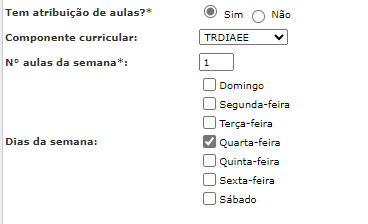
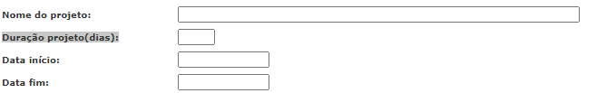

# Instruções para o Processo de Lançamento de Dados

Para compreender este processo, é fundamental ter as informações relativas ao início e fim de cada bimestre:

- **1º Bimestre** - 01/02/2024 até 30/04/2024
- **2º Bimestre** - 01/05/2024 até 12/07/2024
- **3º Bimestre** - 29/07/2024 até 30/09/2024
- **4º Bimestre** - 01/10/2024 até 20/12/2024

O **calendário escolar** também será necessário para a contabilização das datas.

A escola deve estar atenta ao período em que a **Turma de AEE e PROSA** foi iniciada, pois será preciso fazer este lançamento. A turma iniciou no dia **15/04/2024**.

---

### Navegação no Sistema

- **Módulo:** Rede de ensino >> cadastro >> acadêmico >> turma diversificada  
- Navegue pela interface até o botão **Pesquisar**. Ao clicar, uma lista de turmas será carregada.  
- Selecione a turma e, na parte inferior à direita, clique no ícone de **lápis**.

Veja o exemplo abaixo:

---

Lembre-se de que o objetivo é ajustar os dados para **evitar pendências desnecessárias**, então, vamos verificar as configurações destacadas abaixo!

---

Agora, nosso foco é o seguinte bloco de informação:

**Certifique-se de que estes são os dias de atendimento.**

---

Agora, vamos nos concentrar nestes campos:

### Campos para Preenchimento

- **Nome do projeto:** [ AEE, PROSA ou o nome do projeto específico ]
- **Data de Início:** Lance a data em que as atividades iniciaram **15/04/2024**.
- **Data de Fim:** Lance a data de fechamento do ano letivo, **20/12/2024**.

Neste momento, é necessário fazer a **contabilização dos dias** junto ao calendário escolar com base nas datas de início e fim. O campo **Duração do projeto (dias)** deve receber a quantidade de dias apurados.

---

### **MUITA ATENÇÃO!**
Considere os **dias da semana de atendimento** quando estiver no processo de contagem.  
**Esta apuração não é automatizada**, precisa ser verificada manualmente.  
Sabendo o período do bimestre, o processo de contabilização se torna mais ágil.
