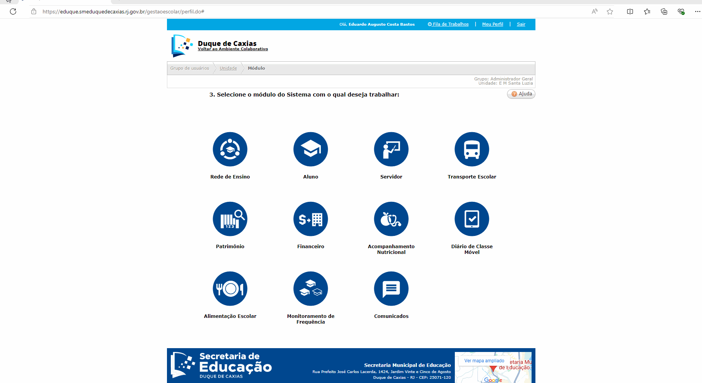

Para compreender este processo  é fundamental ter as informações relativas a início e fim de cada bimestre:

1º Bimestre - 01/02/2024 até 30/04/2024
2º Bimestre - 01/05/2024 até 12/07/2024
3º Bimestre - 29/07/2024 até 30/09/2024
4º Bimestre - 01/10/2024 até 20/12/2024
O clalendário escolar também será necessário para contabilização de datas.

A escola deve estar atenta ao período em que o a Turma de AEE e PROSA foi iniciada, pois será preciso fazer este lançamento. 
A turma iniciou no dia 15/04/2024

Módulo: Rede de ensino >> cadastro >> acadêmico >> turma diversificada
Navegue pela interface até o botão pesquisar. Ao clique um lista de turmas será carregada.
Selecione a turma e o na parte inferior a direita no lápis 
Veja:

Lembre que nosso objetivo é ajustar para que não tenhamos pendencias denecessárias, então vamos verificar as configurações destacadas abaixo! 

Agora nosso foco é este bloco de informação:
Certifique que estes são os dias de atendimento.

Agora o foco são estes coampos:

Nome do projeto:	[ AEE ou PROSA ou o nome do projeto especifico ]
Data Início: Lance a data em que as atividades iniciaram 15/04/2024
Data fim: Lance a data de fechamento do anao letivo, 20/12/2024.
Neste momento é necessário fazer a ontabilização dos dias junto a calendario escolar com base nas datas de inicio e fim, este campo: Duração projeto(dias): deve receber a quantidade de datas apuradas.
Esta apuração não é automatizada, precisa ser manualmente verificada.	Sabendo operiodo do bimestre o processo de contabilização fica mais ágil.
