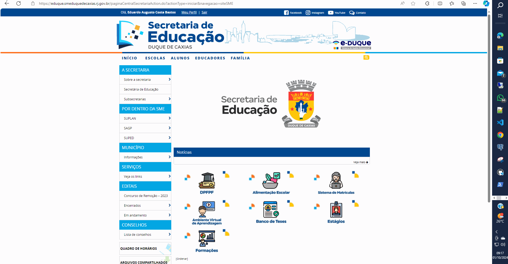

# GUIA  PRÁTICO DE ENCERRAMENTO DO ANO LETIVO 2024
## Sistema de Gestão Acadêmico: E-DUQUE

### Sobre:
Conjunto de instruções agrupados e resumidos para servir como guia de referência e para cunsultas rápidas de acessar os recursos necessários ao processo em questão.


### **Descrição da atividade:**
#### 1 - Conferência de conclusão dos apontamentos de frequência

### **Caminho no sistema**
```
Página Inicial > Educadores > Apontamento de desempenho e frequência das turmas > Pesquisar. Selecione a turma e clique em “Apontamento Diário de Frequência”.
```
