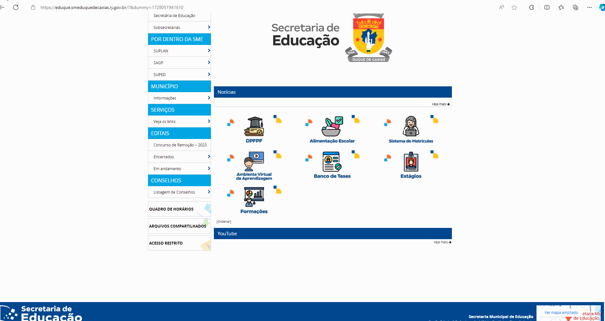
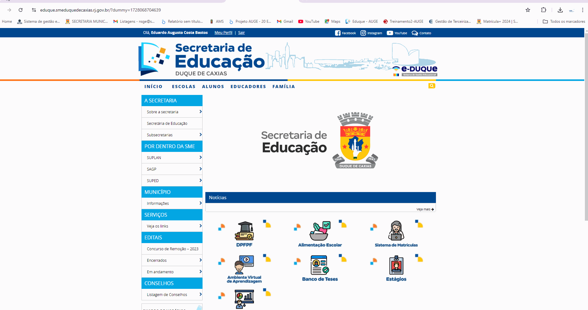
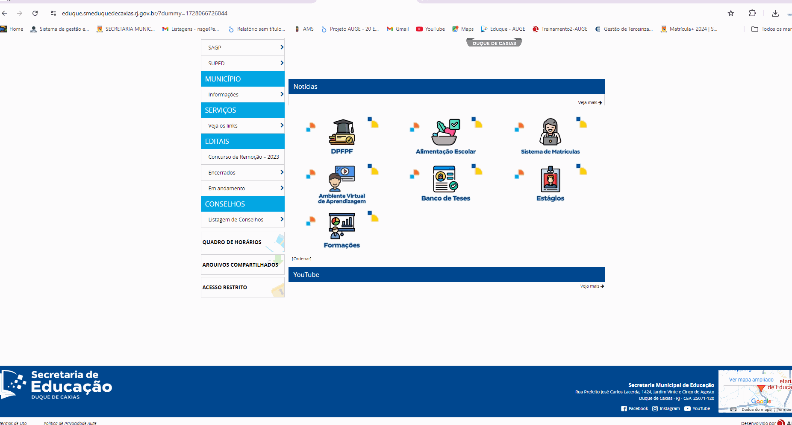
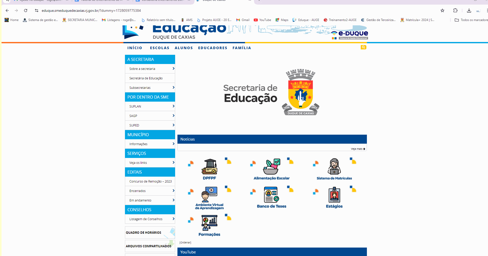

# GUIA  PRÁTICO DE ENCERRAMENTO DO ANO LETIVO 2024
## Sobre:
Conjunto de instruções agrupados e resumidos para servir como guia de referência e para cunsultas rápidas de acessar os recursos necessários ao processo em questão.

# 1 - Conferência de conclusão dos apontamentos de frequência 
```
Página Inicial > Educadores > Apontamento de desempenho e frequência das turmas > Pesquisar. Selecione a turma e clique em “Apontamento Diário de Frequência”.
```


# 2 - Conferência de conclusão dos apontamentos de desempenho / desenvolvimento (Nota) / (Relatório)

```
Página Inicial > Educadores  > Apontamento de desempenho e frequência das turmas > Pesquisar. Selecione a turma e clique em “Apontamento de Frequência e Desempenho / Desenvolvimento".
```


# 3 - Conferência de conclusão dos Registros dos Conteúdos Curriculares

```
Página Inicial > Educadores  > Apontamento de desempenho e frequência das turmas > Pesquisar. Selecione o “Curso”, clique em “Pesquisar”, selecione a “turma” e depois clique em “Registro dos Conteúdos Curriculares Trabalhados”.
```


# 4 - Gerar o parecer conclusivo.

```
Página Inicial > Acesso Restrito > Gestão Escolar > Escolha sua UE > Módulo Aluno > Turmas > Apontamentos > Gerar parecer conclusivo. Selecione o curso e série e clique em Pesquisar, Escolha uma ou mais turmas e clique em “Gerar”.  Confirme a geração do Resultado Final.
```


# 5 - .Lançar as notas de recuperação final.

```
Página Inicial > Educadores  > Apontamento de desempenho e frequência das turmas > Pesquisar. Selecione a turma e clique em “Apontamento de Frequência e Desempenho / Desenvolvimento". Na aba “Avaliação e falta por componente curricular”, selecione “Recuperação Final”, no campo “Apontamento”.
```

# 6 - Gerar o parecer conclusivo para o cálculo do resultado final.

```
Página Inicial > Acesso Restrito > Gestão Escolar > Escolha sua UE > Módulo Aluno > Turmas > Apontamentos > Gerar parecer conclusivo. Selecione o curso e série e clique em Pesquisar, Escolha uma ou mais turmas e clique em “Gerar”.  Confirme a geração do Resultado Final.
```


# 7 - Conferência das notas/média final dos componentes curriculares.

```
Página Inicial > Educadores  > Apontamento de desempenho e frequência das turmas > Pesquisar. Selecione o “Curso”, a “Série”, clique em “Pesquisar”, selecione a “turma”, e depois clique em “Apontamento de Frequência e Desempenho / Desenvolvimento". Na aba “Avaliação e falta por componente curricular”, selecione “Resultado Final do Período Letivo”, no campo “Apontamento”
```


# 8 -  Incluir a observação da ata.

```
Página Inicial > Acesso Restrito > Gestão Escolar > Escolha sua UE > Módulo Aluno > Tabelas > Observações para turmas e alunos. Clique em “Pesquisar” , clique em “incluir”, preencha os campos, clique em “incluir” para adicionar as turmas pertinentes à observação criada e clique em gravar. 
```


# 9 -  I Gerar a Ata de Resultados Finais.

### **Caminho no sistema**
```
Página Inicial > Acesso Restrito > Gestão Escolar > Escolha sua UE > Módulo Aluno > Consultas > Operacionais > Ata de resultados finais. Preencha os campos e clique em gerar. 
```

